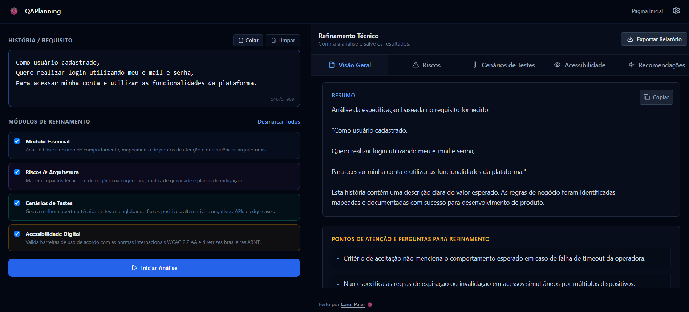

# QAPlanning | Minha atuação como QA na plataforma


> **Sobre este repositório:** Este repositório documenta exclusivamente minha atuação como **Analista de Quality Assurance** durante a validação da plataforma QAPlanning. O desenvolvimento e a arquitetura da aplicação são de autoria de **Caroline Paier** ([Confluence do projeto](#)). Este não é o código-fonte oficial do produto.

---

## Resumo da atuação

- 14 histórias de usuário analisadas
- 48 cenários de teste executados
- 4 bugs registrados
- 5 retestes realizados
- Cenários escritos em Gherkin
- Uso de Jira, Confluence e GitHub

---

## Sobre o projeto

O **QAPlanning** é uma plataforma de refinamento técnico e estratégico de qualidade, baseada em Inteligência Artificial, que ajuda equipes de QA, desenvolvimento e produto a transformar histórias de usuário e critérios de aceite simples em análises profundas e estruturadas — cobrindo riscos, arquitetura, cenários de teste e acessibilidade digital.

**Site oficial:** https://www.qaplanning.ia.br/

A plataforma opera no modelo **BYOK (Bring Your Own Key)**: nenhum dado do usuário fica armazenado em servidor, e dados sensíveis (e-mails, CPFs, telefones, tokens) são automaticamente mascarados antes de qualquer envio para os provedores de IA.

---

## Minha participação

Atuei como **Analista de Quality Assurance** no projeto, colaborando nas etapas de planejamento, execução e validação dos testes da aplicação. Trabalhei diretamente sobre as regras de negócio definidas pela criadora do produto, validando comportamento esperado, mapeando exceções e garantindo cobertura de cenários.

**Principais responsabilidades:**
- Análise de requisitos e critérios de aceite
- Elaboração de cenários de teste em Gherkin
- Execução de testes funcionais (desktop e mobile)
- Validação das regras de negócio da plataforma
- Registro de bugs no Jira
- Retestes após correções
- Apoio na validação final das histórias de usuário

---

## Escopo da minha atuação

Durante minha participação no projeto, fui responsável por:

- Analisar histórias de usuário
- Validar critérios de aceite
- Elaborar cenários em Gherkin
- Executar testes funcionais
- Registrar defeitos no Jira
- Realizar retestes
- Validar correções
- Apoiar a homologação das funcionalidades

---

## Resultados da minha atuação

| Métrica | Resultado |
|---|---:|
| Histórias analisadas | 14 |
| Cenários executados | 48 |
| Bugs registrados | 4 |
| Retestes realizados | 5 |
| Funcionalidades validadas | 14 |


---

## Regras de negócio validadas

Durante a análise e execução dos testes, validei o comportamento da plataforma frente às seguintes regras de negócio:

**Guard-rails de entrada**
- Bloqueio de requisitos com menos de 20 caracteres
- Rejeição de textos repetitivos ou padrão de preenchimento (ex: Lorem Ipsum)
- Interceptação de entradas vagas (ex: "corrigir bug", "mudar o layout") com orientação ao usuário

**Segurança e privacidade (BYOK)**
- Mascaramento automático de e-mails, CPFs, telefones e tokens antes do envio à IA
- Zero armazenamento de dados no servidor

**Gestão de provedores de IA**
- Controle por feature flags: apenas o Google Gemini ativo; OpenAI e Anthropic desativados por estratégia de produto
- Tratamento amigável de falhas (cota excedida, chave inválida, instabilidade do provedor)

**Responsividade**
- Painel de configurações com scroll interno em telas de baixa resolução
- Layout empilhado (single column) em dispositivos móveis
- Geração de PDF limpa, sem elementos de interface, com todas as abas expandidas e sem cortes de texto entre páginas

**Geração de cenários (Gherkin)**
- Sintaxe clássica obrigatória (Funcionalidade, Cenário, Dado, Quando, Então)
- Geração sempre em português
- Proibição de referências à IA ou ao próprio QAPlanning dentro dos cenários gerados
- Saída sem marcações Markdown, pronta para copiar em ferramentas de automação

---

## Fluxo de trabalho

```
História de Usuário
        │
        ▼
Análise dos Requisitos
        │
        ▼
Cenários Gherkin
        │
        ▼
Execução dos Testes
        │
        ▼
Encontrou Bug?
     ┌─────┴─────┐
     │           │
    Sim         Não
     │           │
     ▼           ▼
Registro no Jira   Aprovação
     │
     ▼
Correção pelo Dev
     │
     ▼
Reteste
     │
     ▼
Homologação
```

---

## Exemplo de cenário Gherkin escrito por mim

```gherkin
Funcionalidade: Validar provedores de IA por Feature Flag

  Cenário: Exibir apenas provedores de IA homologados na configuração
    Dado que o usuário possui acesso à tela de Configuração de IA
    E as Feature Flags de provedores não homologados estão desabilitadas
    Quando o usuário acessa a aplicação QAPlanning
    E navega até a tela de Configuração de IA
    E a lista de provedores é carregada
    Então deve ser exibido apenas o provedor Gemini
    E nenhum outro provedor deve ser exibido na interface

  Cenário: Revalidar exibição de provedores após reload da página
    Dado que o usuário acessa a tela de Configuração de IA
    E apenas o provedor Gemini está disponível
    Quando o usuário atualiza a página (F5)
    Então deve continuar sendo exibido apenas o provedor Gemini
```

---

## Ferramentas utilizadas

- Jira
- Confluence
- Gherkin (BDD)
- GitHub

## Tecnologias do produto testado

- TypeScript
- Google Gemini API
- Local Storage
- Inteligência Artificial Generativa

## Competências desenvolvidas

- Testes Funcionais
- Análise de Requisitos
- Escrita de Casos de Teste (Gherkin / BDD)
- Registro e acompanhamento de bugs
- Retestes
- Validação de Critérios de Aceite
- Trabalho em equipe e metodologias ágeis

---

## Evidências

> Adicione aqui as capturas de tela dentro da pasta `/imagens`, referenciando cada uma como abaixo. Quanto mais completa essa seção, mais credibilidade o repositório passa.

**Tela inicial da plataforma**


**Painel de refinamento técnico e resultados**




**Cenários Gherkin no editor**


)


---

## Aprendizados

Participar do QAPlanning me deu experiência prática em um ambiente colaborativo real de desenvolvimento de software, aplicando conceitos de Quality Assurance desde a análise de requisitos até a validação das funcionalidades entregues. Desenvolvi habilidades em elaboração de cenários de teste, execução de testes funcionais, registro de defeitos, retestes e uso de Jira e Confluence dentro de um fluxo ágil — sempre em colaboração com a Caroline Paier, criadora e responsável pelo produto.

---

## Links

- **Site oficial do QAPlanning:** https://www.qaplanning.ia.br/
- **Autoria da plataforma:** Caroline Paier

---

## Sobre mim

**Priscila Gianni Rodrigues de Melo Silva**
Analista de Quality Assurance, com experiência prática em testes funcionais, análise de requisitos, elaboração de cenários Gherkin, gestão de defeitos e validação de funcionalidades em projetos reais.
